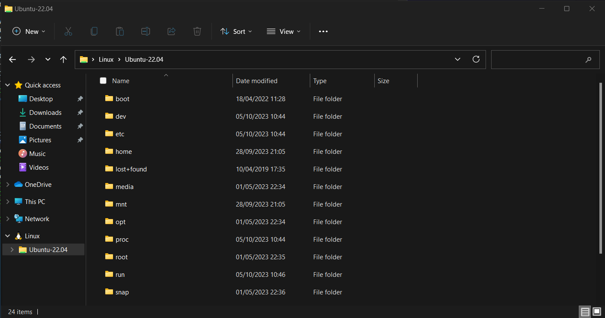

# File Systems

You can map the linux file system as a network drive using

```
\\wsl$\Ubuntu\
```

My installations also show in Windows Explorer.

<figure><figcaption></figcaption></figure>

From Linux, my Windows file system shows under /mnt

<figure><figcaption></figcaption></figure>
