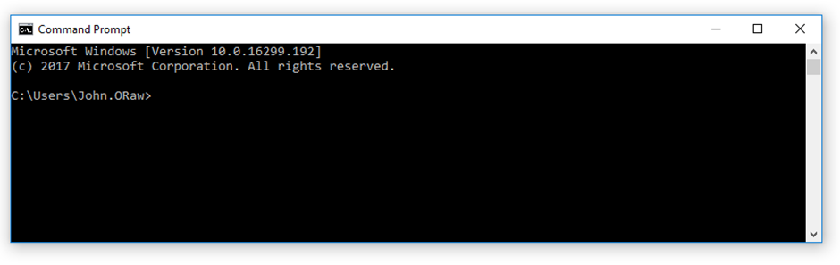

# The Command Line Interpreter (CLI)

On a Windows computer click the start button, then run then **cmd**. This will open a command window as shown below.

<figure><figcaption></figcaption></figure>

In Windows, if you type a command which is not understood, you get a response&#x20;

**……. is not recognized as an internal or external command, operable program, or batch file.**&#x20;

You need to be aware of the computer's response as we are going along. If the computer responds to a command with an error, go back and check the command again, it probably hasn't been carried out.&#x20;

To find out what version of operating system you are running,&#x20;

In DOS type **ver** and press return&#x20;

Note that all commands and file names in DOS are NOT case sensitive.&#x20;

